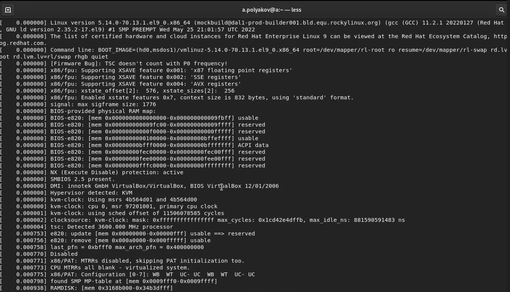
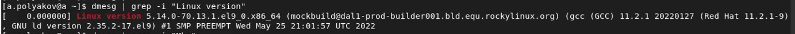
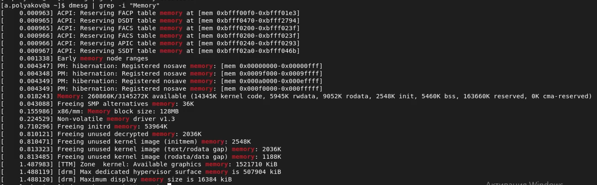
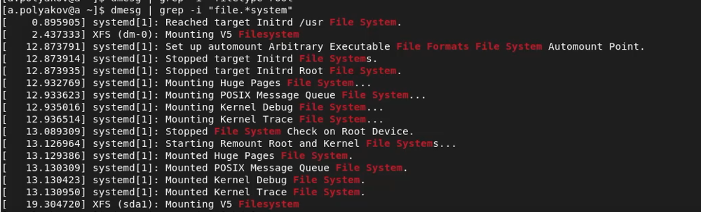
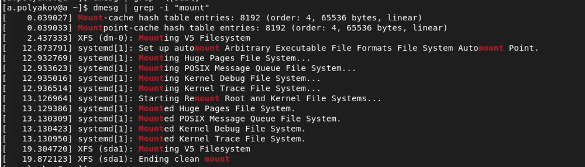

<!-- _class: titleslide -->

#### РОССИЙСКИЙ УНИВЕРСИТЕТ ДРУЖБЫ НАРОДОВ
#### Факультет физико-математических и естественных наук  
#### Кафедра прикладной информатики и теории вероятностей 
#### ПРЕЗЕНТАЦИЯ ПО ЛАБОРАТОРНОЙ РАБОТЕ №1

###### дисциплина: Информационная безопасность
###### Преподователь: Кулябов Дмитрий Сергеевич
###### Студент: Поляков Арсений Андреевич
###### Группа: НФИбд-01-19
МОСКВА
2022 г.

---

# **Цели и задачи**
1. Приобретение практических навыков
установки операционной системы на виртуальную машину
2. Настройка минимально необходимых для дальнейшей работы сервисов

---

# Выполнение
## Выполнение
### Последовательность загрузки ОС

---

## Выполнение
### Версия ядра Linux

### Частота процессора

---

## Выполнение
### Модель процессора

### Объем доступной оперативной памяти

---

## Выполнение
### Тип обнаруженного гипервизора

### Тип файловой системы корневого раздела

---

## Выполнение
### Последовательность монтирования файловых систем

---

# Результаты
1. Приобретены практические навыки
установки операционной системы на виртуальную машину
2. Настроены минимально необходимые для дальнейшей работы сервисы

---

# Список литературы
1. Методические материалы курса
2. Задание к лабораторной работе № 1

---