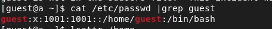

<!-- _class: titleslide -->

#### РОССИЙСКИЙ УНИВЕРСИТЕТ ДРУЖБЫ НАРОДОВ
#### Факультет физико-математических и естественных наук  
#### Кафедра прикладной информатики и теории вероятностей 
#### ПРЕЗЕНТАЦИЯ ПО ЛАБОРАТОРНОЙ РАБОТЕ №2

###### дисциплина: Информационная безопасность
###### Преподователь: Кулябов Дмитрий Сергеевич
###### Студент: Поляков Арсений Андреевич
###### Группа: НФИбд-01-19
МОСКВА
2022 г.

---

# **Цель работы**

Получение практических навыков работы в консоли с атрибутами файлов, закрепление теоретических основ дискреционного разграничения доступа в современных системах с открытым кодом на базе ОС Linux.

---

# **Выполнение лабораторной работы**

1. На виртуальной машине создал нового пользователя guest и задал для него пароль

2. Вошёл в систему от имени guest

--- 

3. Командой pwd определил каталог, в котором нахожусь. Данный каталог является домашним для пользователя guest, что совпадает с приглашением в командной строке.

4. Вывел имя пользователя

5. Вывел на экран информацию о пользователе. Guest имеет идентификатор 1001(guest), группа пользователя 1001(guest), состоит в группе 1001(guest). Команда groups выдаёт группу guest.

--- 

6. Просмотрел файл passwd, в котором увидел, что данные из пункта 5, совпадают с данными в файле, то есть uid = 1001, gid = 1001.

7. На данный момент в системе находится 2 домашних директории. Для каждого пользователя по одной, а именно a.polyakov и guest. У обоих есть права только для пользователя.

8. Расширенные атрибуты я смог увидеть только у каталога guest, потому что в данный момент я залогинен под ним. Как можно заметить, ни один из расширенных атрибутов не стоит .

--- 

9. В домашней директории создал каталог dir1 и убрал все права. После этого попытался создать файл, и файл не создался, так как прав на каталог у меня нет

--- 

10. Экспериментальным путём заполнил таблицу с правами и возможностями.

--- 

--- 

11. В отдельной таблице указал минимальные права для определённых действий.

--- 

# Выводы

Выполнив данную лабораторную работу, я создал нового пользователя, определил необходимую информацию, а также определил права, необходимые для действий с файлами и каталогами.

--- 
