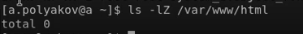

# Цель работы

Целью данной лабораторной работы является развить навыки администрирования ОС Linux. Получить первое практическое знакомство с технологией SELinux1. Проверить работу SELinx на практике совместно с веб-сервером Apache.

# Выполнение лабораторной работы

1. Входим в систему с полученными учётными данными. Проверили, что SELinux работает в режиме enforcing политики targeted с помощью команд **getenforce** и **sestatus**.
   

2. Запустили веб-сервер и обратились к нему с помощью команды:
service httpd status 
   

3. Найшли веб-сервер Apache в списке процессов с помощью команды **ps auxZ | grep httpd**. Контекст безопасности - unconfined_u:unconfined_r:unconfined_t. 
   

4. Посмотрели текущее состояние переключателей SELinux для Apache с помощью команды .
   

5. Посмотрели статистику по политике с помощью команды **seinfo**. Определили, что множество пользователей = 8; ролей = 14; типов = 5002.
   

6. Определили тип файлов и поддиректорий, находящихся в директории /var/www, с помощью команды **ls -lZ /var/www**.
   

7. Необходимо было определить тип файлов, находящихся в директории /var/www/html, с помощью команды **ls -lZ /var/www/html**. Но в данной директории файлов не обнаружилось. 
   

9. Создали от имени суперпользователя html-файл /var/www/html/test.html следующего содержания: 
   

10. Проверили контекст созданного файла - httpd_sys_content_t.
   

11.  Обратитились к файлу через веб-сервер, введя в браузере адрес http://127.0.0.1/test.html и убедились, что файл был успешно отображён. 
   

12.   Изучили справку man httpd_selinux. Тип файла test.html - контекст созданного файла - httpd_sys_content_t. 
   

13.  Изменили контекст файла /var/www/html/test.html с httpd_sys_content_t на samba_share_t:
chcon -t samba_share_t /var/www/html/test.html
ls -Z /var/www/html/test.html
И проверили, что контекст поменялся.
   

14. Пробуем ещё раз получить доступ к файлу через веб-сервер, введя в браузере адрес http://127.0.0.1/test.html. В результате получили ошибку.
   

15.  Проанализируем ситуацию. Почему файл не был отображён, если права доступа позволяют читать этот файл любому пользователю?
ls -l /var/www/html/test.html
Просмотрим log-файлы веб-сервера Apache и системный лог-файл:
tail /var/log/messages
В системе оказались запущенны процессы **setroubleshootd** и **audtd**. 
   

16. Попробуем запустить веб-сервер Apache на прослушивание ТСР-порта 81. Для этого в файле /etc/httpd/httpd.conf находим строчку Listen 80 и заменяем её на Listen 81.
   

 
17. Выполним перезапуск веб-сервера Apache. Произошёл сбой? Нет. 
18. Проанализируем лог-файлы:
tail -nl /var/log/messages
Просмотрим файлы /var/log/http/error_log,
/var/log/http/access_log и /var/log/audit/audit.log. 
   

19. Выполним команду **semanage port -a -t http_port_t -р tcp 81**. Вылетает ValueError в связи с тем, что порт уже определен. После этого проверим список портов командой **semanage port -l | grep http_port_t** и убедились, что порт 81 появился в списке.
   

20. Попробуем запустить веб-сервер Apache ещё раз. 
   

  
21. Вернули контекст httpd_sys_cоntent__t к файлу /var/www/html/test.html: **chcon -t httpd_sys_content_t /var/www/html/test.html** 
   

После этого пробуем получить доступ к файлу через веб-сервер, введя в браузере адрес http://127.0.0.1:81/test.html. В результате увидели содержимое файла — слово «test». 
   

22. Исправим обратно конфигурационный файл apache, вернув Listen 80. 
   

23. Удалим привязку http_port_t к 81 порту: **semanage port -d -t http_port_t -p tcp 81** и проверим, что порт 81 удалён. Данная команда не была выполнена. 
   

24.  Удалим файл /var/www/html/test.html: **rm /var/www/html/test.html**.
   

# Вывод

В ходе выполнения лабораторной работы мы развили навыки администрирования ОС Linux. Получили первое практическое знакомство с технологией SELinux1. Проверили работу SELinx на практике совместно с веб-сервером
Apache.

# Библиография

1. Кулябов Д. С., Королькова А. В., Геворкян М. Н. Мандатное разграничение прав в Linux [Текст] / Кулябов Д. С., Королькова А. В., Геворкян М. Н. - Москва: - 5 с. [^1]: Мандатное разграничение прав в Linux. 
2. Справочник 70 основных команд Linux: полное описание с примерами (https://eternalhost.net/blog/sozdanie-saytov/osnovnye-komandy-linux)
  