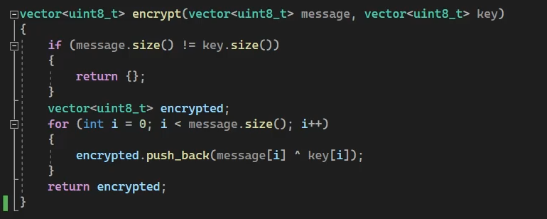
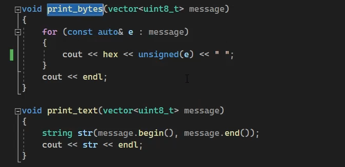
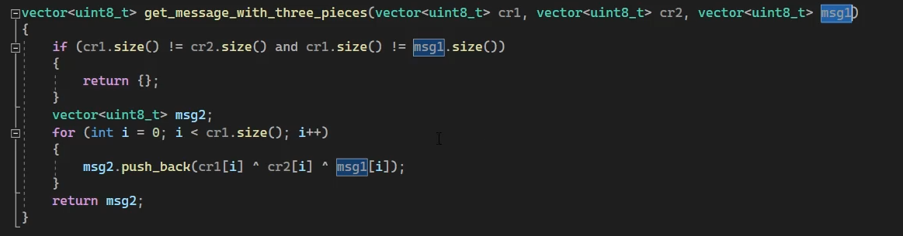
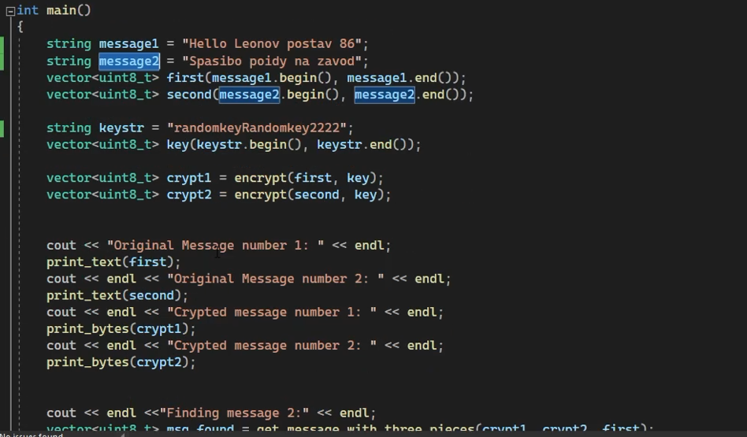
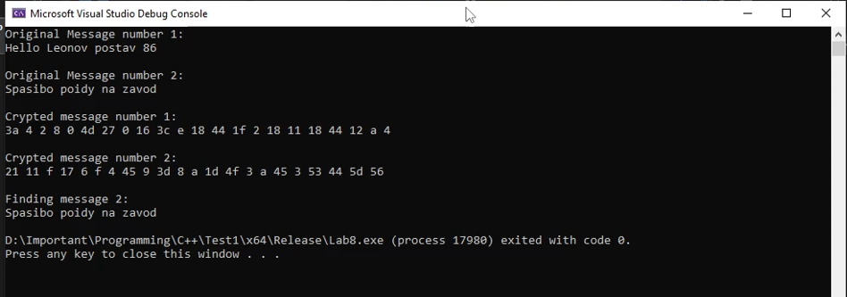

<!-- _class: titleslide -->

#### РОССИЙСКИЙ УНИВЕРСИТЕТ ДРУЖБЫ НАРОДОВ
#### Факультет физико-математических и естественных наук  
#### Кафедра прикладной информатики и теории вероятностей 
#### ПРЕЗЕНТАЦИЯ ПО ЛАБОРАТОРНОЙ РАБОТЕ №8

###### дисциплина: Информационная безопасность
###### Преподователь: Кулябов Дмитрий Сергеевич
###### Студент: Поляков Арсений Андреевич
###### Группа: НФИбд-01-19
МОСКВА
2022 г.

---

# **Цель работы**

Освоить на практике применение режима однократного гаммирования
на примере кодирования различных исходных текстов одним ключом

---

# **Выполнение лабораторной работы**

# 1. Создал функцию позволяющую зашифровывать, расшифровывать данные с помощью сообщения и ключа. А также позволяющую получить ключ

---

# 2. Cоздал функцию для вывода результатов

---

# 3. Создал функцию определения текста, зная два шифротекста и оригинальный текст одного из них

---

# 4. Определил главную функцию 

---

# 5. Запуск программы

---

# 6. Способ, при котором злоумышленник может прочитать оба текста, не зная ключа и не стремясь его определить:
злоумышленник может получить два зашифрованных текста, например, во время 
передачи информации через сеть. Также если он сможет получить часть оригинального
сообщения одного из двух зашифрованных текстов, он сможет прочитать оба текста и без ключа.

---

# Вывод
В результате выполнения работы я освоил на практике применение режима однократного гаммирования на примере кодирования различных исходных текстов одним ключом