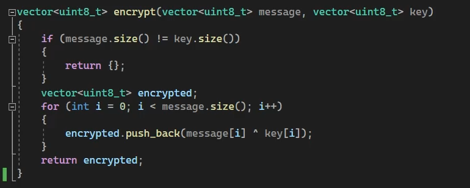
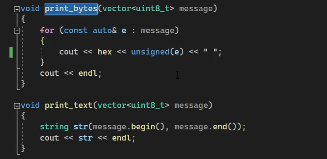
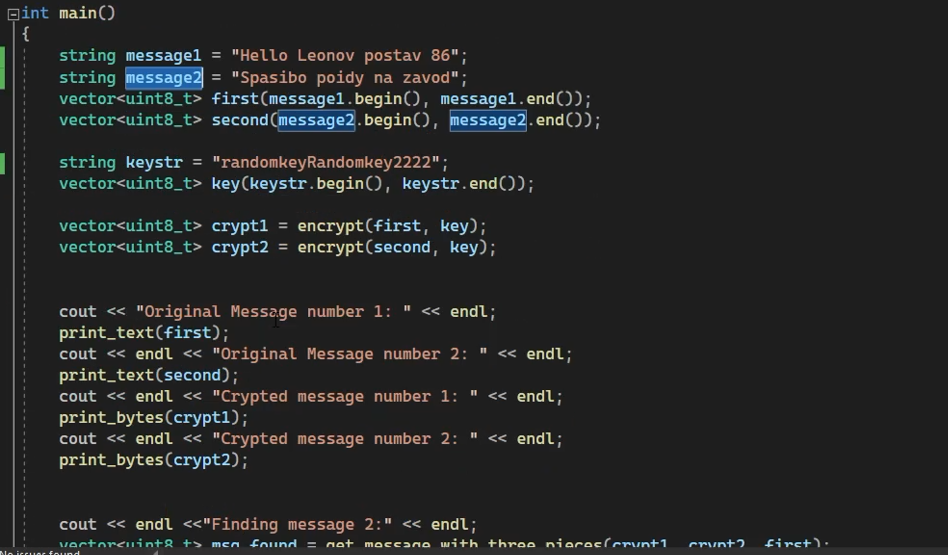
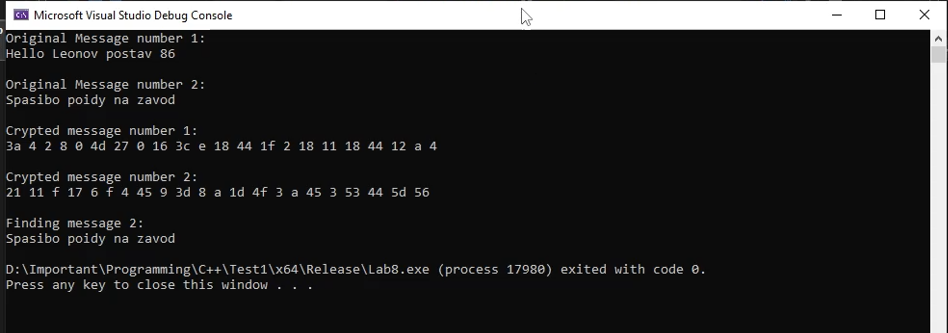

---
# Front matter
title: "Лабораторная работа 8"
author: "Поляков Арсений Андреевич, НФИбд-01-19"

# Generic otions
lang: ru-RU
toc-title: "Содержание"

# Bibliography
bibliography: bib/cite.bib
csl: pandoc/csl/gost-r-7-0-5-2008-numeric.csl

# Pdf output format
toc: true # Table of contents
toc_depth: 2
lof: true # List of figures
lot: true # List of tables
fontsize: 12pt
linestretch: 1.5
papersize: a4
documentclass: scrreprt
## I18n
polyglossia-lang:
  name: russian
  options:
	- spelling=modern
	- babelshorthands=true
polyglossia-otherlangs:
  name: english
### Fonts
mainfont: PT Serif
romanfont: PT Serif
sansfont: PT Sans
monofont: PT Mono
mainfontoptions: Ligatures=TeX
romanfontoptions: Ligatures=TeX
sansfontoptions: Ligatures=TeX,Scale=MatchLowercase
monofontoptions: Scale=MatchLowercase,Scale=0.9
## Biblatex
biblatex: true
biblio-style: "gost-numeric"
biblatexoptions:
  - parentracker=true
  - backend=biber
  - hyperref=auto
  - language=auto
  - autolang=other*
  - citestyle=gost-numeric
## Misc options
indent: true
header-includes:
  - \linepenalty=10 # the penalty added to the badness of each line within a paragraph (no associated penalty node) Increasing the value makes tex try to have fewer lines in the paragraph.
  - \interlinepenalty=0 # value of the penalty (node) added after each line of a paragraph.
  - \hyphenpenalty=50 # the penalty for line breaking at an automatically inserted hyphen
  - \exhyphenpenalty=50 # the penalty for line breaking at an explicit hyphen
  - \binoppenalty=700 # the penalty for breaking a line at a binary operator
  - \relpenalty=500 # the penalty for breaking a line at a relation
  - \clubpenalty=150 # extra penalty for breaking after first line of a paragraph
  - \widowpenalty=150 # extra penalty for breaking before last line of a paragraph
  - \displaywidowpenalty=50 # extra penalty for breaking before last line before a display math
  - \brokenpenalty=100 # extra penalty for page breaking after a hyphenated line
  - \predisplaypenalty=10000 # penalty for breaking before a display
  - \postdisplaypenalty=0 # penalty for breaking after a display
  - \floatingpenalty = 20000 # penalty for splitting an insertion (can only be split footnote in standard LaTeX)
  - \raggedbottom # or \flushbottom
  - \usepackage{float} # keep figures where there are in the text
  - \floatplacement{figure}{H} # keep figures where there are in the text
---

<h1 align="center">

РОССИЙСКИЙ УНИВЕРСИТЕТ ДРУЖБЫ НАРОДОВ 

Факультет физико-математических и естественных наук  

Кафедра прикладной информатики и теории вероятностей

ОТЧЕТ ПО ЛАБОРАТОРНОЙ РАБОТЕ №8
  
<h2 align="right">

дисциплина: Информационная безопасность

Преподователь: Кулябов Дмитрий Сергеевич

Студент: Поляков Арсений Андреевич

Группа: НФИбд-01-19
  
  
<h1 align="center">

МОСКВА

2022 г.
</h1>

# Цель работы

Освоить на практике применение режима однократного гаммирования
на примере кодирования различных исходных текстов одним ключом

# Выполнение лабораторной работы

** Постановка задачи **
Два текста кодируются одним ключом (однократное гаммирование).
Требуется не зная ключа и не стремясь его определить, прочитать оба текста. Необходимо разработать приложение, 
позволяющее шифровать и дешифровать тексты P1 и P2 в режиме однократного гаммирования. 
Приложение должно определить вид шифротекстов C1 и C2 обоих текстов P1 и
P2 при известном ключе ; Необходимо определить и выразить аналитически способ, при котором злоумышленник может 
прочитать оба текста, не зная ключа и не стремясь его определить.

Для этого у меня есть функция позволяющая зашифровывать, расшифровывать данные с помощью сообщения и ключа. А также позволяющая получить ключ

Функция для вывода результатов

Фунцкия определения текста, зная два шифротекста и оригинальный текст одного из них

Главная функция 

Затем я запускаю программу, получаю два шифротекста для каждого текста при известном ключе.
Далее не зная ключа и не стремясь его определить, получаю текст 

Способ, при котором злоумышленник может прочитать оба текста, не
зная ключа и не стремясь его определить: 
злоумышленник может получить два зашифрованных текста, например, во время 
передачи информации через сеть. Также если он сможет получить часть оригинального
сообщения одного из двух зашифрованных текстов, он сможет прочитать оба текста и без ключа.

# Выводы

В результате выполнения работы я освоил на практике применение режима однократного гаммирования на примере кодирования различных исходных текстов одним ключом

# Список литературы

1. Методические материалы курса
